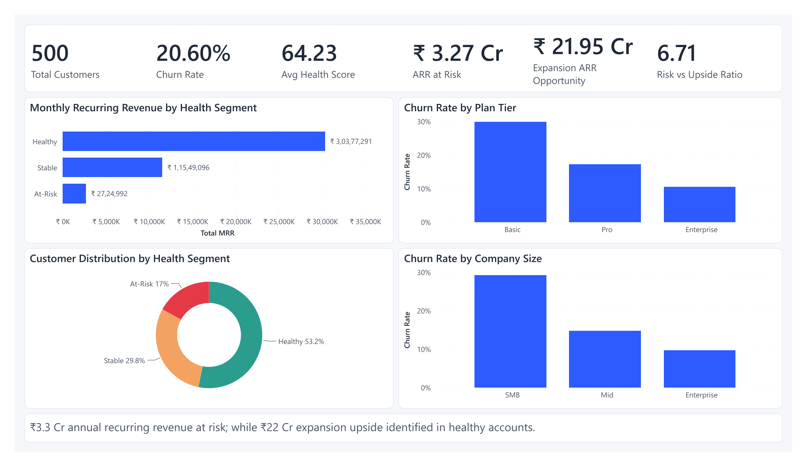
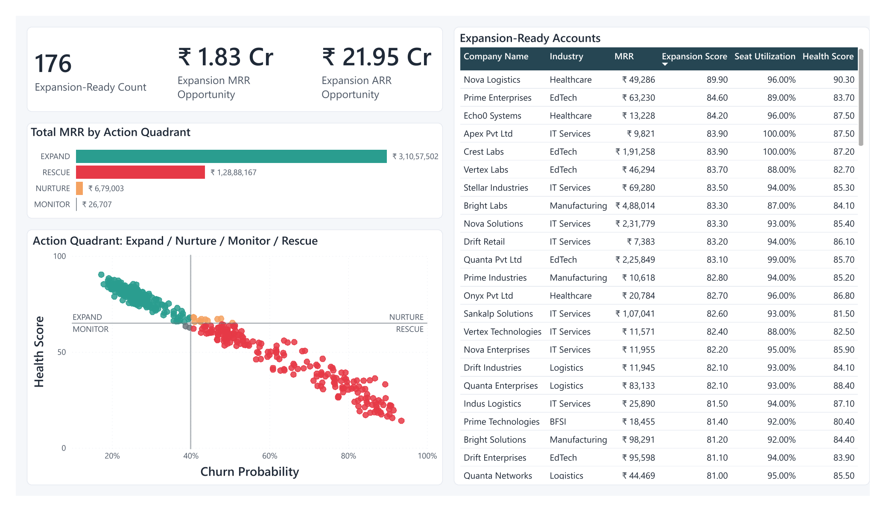
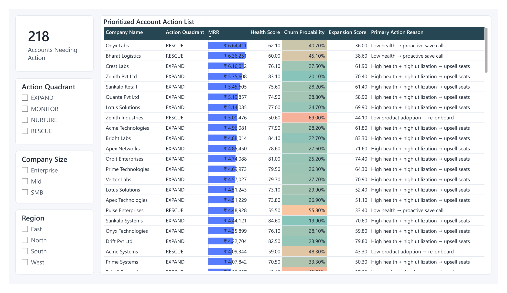

# Customer Health Score & Expansion Revenue Model

> Predicting churn and identifying upsell opportunities for a mid-market B2B SaaS company, combining a business-defined **Customer Health Score**, an **interpretable churn model**, and an **expansion-propensity engine** - delivered as an action-oriented Power BI dashboard.



---

## The Problem

A mid-market B2B SaaS customer in India is growing its customer base but losing revenue silently. Its Customer Success (CS) team is **reactive** - intervening only after a customer is already angry or about to cancel - and has **no systematic way** to spot which healthy customers are ready to be upsold.

This project builds a **Customer Health Score system** that proactively flags at-risk accounts **and** identifies-expansion ready accounts, so CS and Sales teams know exactly who to focus on each week.

---

## Key Results

| Metric | Result |
| ------ | ------ |
| Customer analysed | 500 accounts x 24 months |
| Churn model performance | **ROC-AUC 0.79** (interpretable logistic regression) |
| At-Risk vs Healthy churn | **51% vs 6%** - a 8x difference |
| ARR flagged at risk | **₹3.3 Cr** |
| Expansion ARR opportunity identified | **₹22 Cr** across 176 accounts |
| Top churn drivers | Payment delays • Low seat utilization • Slow support resolution |

---

## Approach 

### 1. Data
Engineered a realistic **4-table relational dataset** (companies, monthly usage, support billing) for 500 Indian SMB/mid-market/enterprise accounts over 24 months.
> **Why synthetic?** Real B2B SaaS customer-health data is confidential and never public. I engineered it to reflect realistic patterns - churn correlating with low usage, support delays, and billing friction - so the *analytical logic* is the focus and the project is **fully reproducible**.

### 2. Customer Health Score (0-100)
A weighted composite of four business dimensions:
| Dimension | Weight | Rationale |
| --------- | ------ | --------- |
| Product Health | 40% | Value realization is the #1 retention driver |
| Support Health | 25% | Poor support drives friction-based churn |
| Billing Health | 20% | Payment friction signals dissatisfaction |
| Engagement Trend | 15% | Leading indicator of early decline |

Validated against actual churn: health score correlates negatively with churn, and segments show a clean 8x churn gradient (At-Risk -> Stable -> Healthy).

### 3. Churn Prediction (interpretable)
A **logistic regression** chosen deliberatelv over black-box models -the CS team needs to know *why* an account is risky, not just that it is. Diagnosed and corrected multicollinearity to ensure all driver coefficients align with business logic, holding ROC- AUC at 0.79.

### 4. Expansion Propensity + Action Quadrant
A rule-and-score hybrid flags **expansion-ready** accounts (healthy, high utilization, growing, clean billing, low churn risk). Every account is mapped to a **2x2 action quadrant**:

| | Low Churn Risk | High Churn Risk |
| --- | --- | --- |
| **High Health** | EXPAND | NURTURE |
| **Low Health** | MONITOR | RESCUE |

---

## Dashboard

A 5-page Power Bl dashboard built as a **decision tool**, not a chart dump:
| Page |Purpose |
| ---- | ------ |
| Executive Overview | Health + risk-vs-upside in 5 seconds |
| Customer Health Drivers | What drives health, and where weakness concentrates |
| Churn Risk & Drivers | Who is at risk and why |
| Expansion Opportunities | Prioritised upsell targets + action quadrant |
| Account Action List| "Who to contact this week, and why" |


 



---

## Teck Stack

Python (pandas, scikit-learn, scipy) • Power BI • DAX

---

## Reproduce This Project


```bash
# 1. Install dependencies 
pip install- requirements.txt`
# 2.Generate the synthetic dataset 
python scripts/generate_data.py
# 3. Build the health score + features 
python scripts/build_features.py
# 4. Train the churn model + expansion logic 
python scripts/build_models.py
# 5. Open dashboard/customer_health_dashboard.pbix in Power BI Desktop
```

All outputs (CSVs, model metrics, feature importance) regenerate deterministically (fixed random seed).


---


## Repository Structure
```
scripts/ → data generation, feature engineering, modelling
data/ → generated datasets
output/ → model metrics & feature importance
dashboard/ → Power BI .pbix + PDF export
assets/ → dashboard screenshots
```


---


## Author
**[Nehi Jain]**-[https://www.linkedin.com/in/nehijain/]•[nehijain16@gmail.com]
*Product focused Analyst Building analytics that drive business decisions*


 
